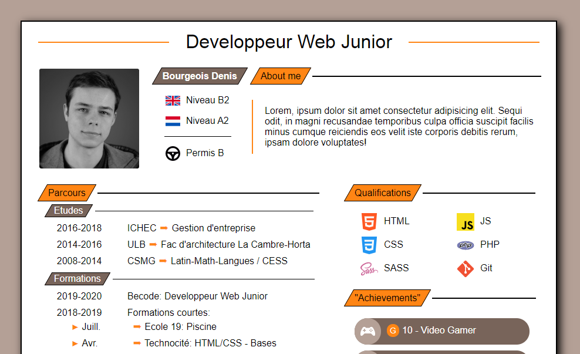

# Project Title - **CV**

## Presentation

Made at the end of 2019, without any particular instructions.

Acces the page [here](...) (Link to come)

[x] Codebase formated by [Prettier](https://prettier.io/)  
[x] Html validated by [W3C Markup Validation Service](https://validator.w3.org)

### **[Bourgeois Denis - CV](....html)** (Link to come)

The goal was to have a structured, short, and original CV, made with PHP and SASS (even though PHP wasn't really used). Will be integrated in a later Portfolio.

## Contributors

-   [**Denis Bourgeois**](https://github.com/Debourgeo)

## (Feedback)

-   Responsive yet to be finished
-   Need to be rationalized, SASS-wise.
-   Some work yet to be done on the Headers and Footers.

## Langages

-   **(PHP)** - **HTML**
-   **SASS**

## Framework

-   /

## Libraries

-   /

## State

Still WIP, stopped July 4th, 2020.
